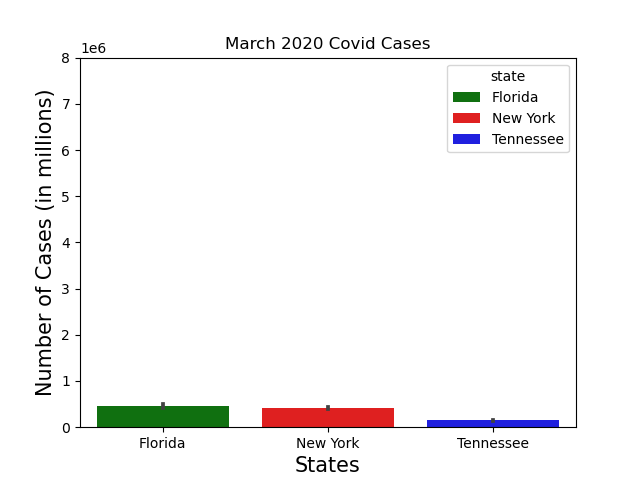
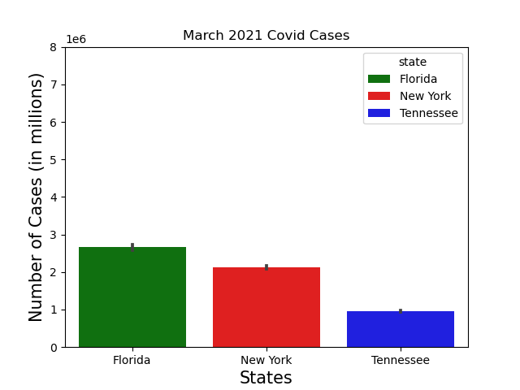
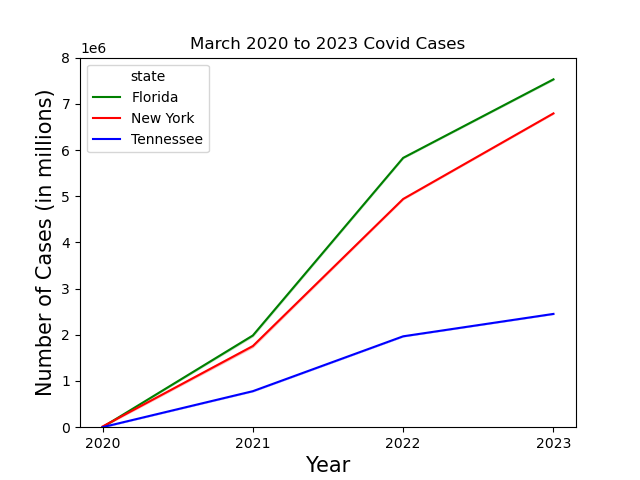

# Spring Break During Covid

## Members

-Robyn Leslie
-Jennifer Hooker
-Traci Ellis
-Brittany Butchkoski

# Introduction

Imagine you are a college student planning on taking a trip out of state to go on vacation for spring break but we are still in the middle of a pandemic. To be able to travel and actually enjoy your vacation you must avoid all heavy populated areas with Covid. The data we have collected from 2020 to early 2023 will help us predict just how to do so by mapping out the covid hotspots in the US, and three popular states to visit while on spring break, we will aslo have a break down of those three states by county so you know which areas to steer clear of. 

The three states chosen are as listed:

-Florida

-New York

-Tennessee

# Data Collection and Observations

Since spring break is typically during the month of March we are going to filter the data fore the month of March from 2020 to 2023 to help us predict whether or not we shopuld plan our spring break in a certain location or not. 

These observations will be based on data collected by The New York Times from 01 January 2020- 23 March 2023. The New York Times released a series of data files with cumulative counts of coronavirus cases in the United States, at the state and county level, over time. Although since the first reported case was not until January 21st 2020, The New York Times has tracked the cases of the virus in real time as they were identified after testing. Unfortunately due to a wide spread shortage in testing data was limited which may affect the overall picture presented of the outbreak.

The data collected may be flawed in the sense that if a person was diagnosed with covid in FL for example but died in another state the state they died in would count the death for their state and FL would also document the death in their records as well. Another issue would be the delay of information, once the information was avaliable it was added to the data set.

"Probable" and "Confirmed cases and Deaths" 
Confirmed cases and Deaths can be either be confirmed as "confirmed" or "probable". The number of cases represents the cases that have recovered or died. And the total cases and deaths include both. Some governments continued to report only confirmed cases, while others are reporting both confirmed and probable numbers. Some reporting the two types of numbers combined without providing a way to separate the confirmed from the probable. This may alter the results of the data as well.

The Geographic Exceptions section below has more details on specific areas. The methodology of individual states changes frequently.

#### New York 

All cases for the five boroughs of New York City (New York, Kings, Queens, Bronx and Richmond counties) are assigned to a single area called New York City. The number of deaths in New York City also includes probable deaths reported by the New York City health department. Deaths are reported by county of residence, except for certain periods described below.

The New York Times has changed the way we have counted deaths in New York State a few times in response to changes in how the state and New York City report their data.

#### Confirmed cases: 

are counts of individuals whose coronavirus infections were confirmed by a laboratory test and reported by a federal, state, territorial or local government agency. Only tests that detect viral RNA in a sample are considered confirmatory. These are often called molecular or RT-PCR tests.

#### Probable cases: 

count individuals who did not have a confirmed test but were evaluated by public health officials using criteria developed by states and the federal government and reported by a health department.

Public health officials consider laboratory, epidemiological, clinical and vital records evidence. Tests that detect antigens or antibodies are considered evidence towards a “probable” case, but are not sufficient on their own, according to the Council of State and Territorial Epidemiologists.

#### Confirmed Deaths:

Confirmed deaths are individuals who have died and meet the definition for a confirmed Covid-19 case. Some states reconcile these records with death certificates to remove deaths from their count where Covid-19 is not listed as the cause of death. We follow health departments in removing non-Covid-19 deaths among confirmed cases when we have information to unambiguously know the deaths were not due to Covid-19, i.e. in cases of homicide, suicide, car crash or drug overdose.

#### Probable Deaths:

Probable deaths are deaths where Covid-19 is listed on the death certificate as the cause of death or a significant contributing condition, but where there has been no positive confirmatory laboratory test.

Deaths among probable cases tracked by a state or local health department where a death certificate has not yet been filed may also be counted as a probable death.

#### FIPS

FIPS stands for Federal Information Proccessing Standards. It is a standard for adoption and use by United States Federal departments and agencies that has been developed within the Information Technology Laboratory and published by the National Institute of Standards and Technology (NIST), a part of the U.S. Department of Commerce. FIPS codes are numbers which uniquely identify geographic areas. The number of digits in FIPS codes vary depending on the level of geography. State-level FIPS codes have two digits, county-level FIPS codes have five digits of which the first two are the FIPS code of the state to which the county belongs.

Here is a link that shows the US FIPS codes:

https://transition.fcc.gov/oet/info/maps/census/fips/fips.txt#:~:text=FIPS%20codes%20are%20numbers%20which,to%20which%20the%20county%20belongs.

# Ethical Considerations:

For this project we decided to use data collected by The New York Times. In order to do so we had to inform The New York Times that we plan on using their data from their github for our project. This follows ethical standards because we asked for consent for the use of their data that they collected. The New  York Times was also transparent about the discrepancies in the data from how it was documented from other sources, as mentioned above. The data we decided to use for the project may not be exact but it will still give us a good overall picture of the covid statics for the US, states chosen, and their counties. The data used for this project also follows confidentiality in the sense that patients names were not mentioned, only the necessary data was used for the project.

# Visualizations and User-driven Interactions:

The photos below represent the number of covid cases in during the month of March ranging from year 2020 to 2023.

This image below shows an increase of the covid cases through 2020 to 2023 for Colorado, Florida, and New York.

# Interacting with the Map

To interact with the map just hover over the county you are interested in seeing the total number of documented covid cases at the time is March 23rd, 2023. This was the last day the data was recorded. This works for our project since Spring Break typicaly occurs in the middle of March.

# References

 "The New York Times. (2021). Coronavirus (Covid-19) Data in the United States. Retrieved [09 January 2024], from https://github.com/nytimes/covid-19-data."

 
Here is a link that shows the US FIPS codes:

https://transition.fcc.gov/oet/info/maps/census/fips/fips.txt#:~:text=FIPS%20codes%20are%20numbers%20which,to%20which%20the%20county%20belongs.

This is where we retrieved the GeoJSON data for our interactive plotly map:

https://raw.githubusercontent.com/plotly/datasets/master/geojson-counties-fips.json

